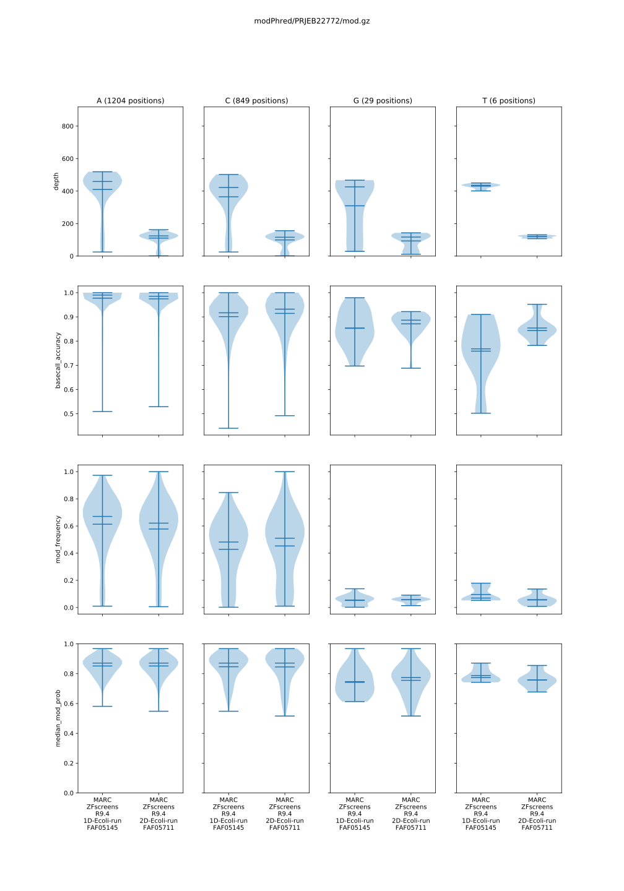
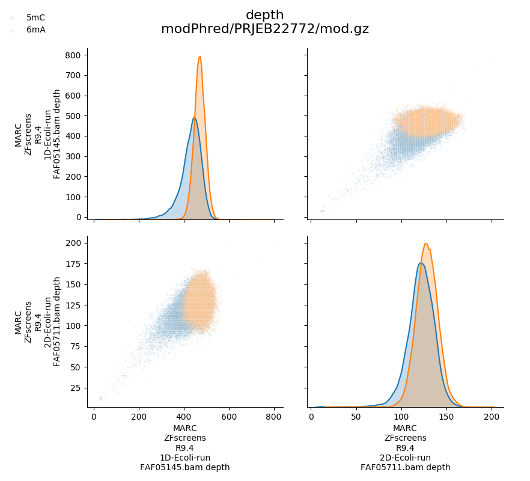

# Documentation
modPhred is a pipeline for **detection and annotation of DNA/RNA modifications from raw ONT data**.
Here, you'll find detailed description of modPhred internals.

- **[Installation](#installation)**
- **[Running the pipeline](#Running-the-pipeline)**
- **[Visualisation](#visualisation)**
  - **[Plotting](#plotting)** 
  - **[QC plots](#QC-plots)** 
  - **[IGV](#igv)**  
- **[Data formats](#data-formats)**
  - **[bedMethyl](#bedMethyl)**
  - **[mod.gz](#modgz)**
- **[Methods - how does it work?](#methods)**
  - **[Encoding of modifications](#encoding-of-modifications)**
  - **[Alignments](#alignments)**
  - **[Detection of modifications](#detection-of-modifications)**
  - **[QC](#qc)**
- **[Frequently Asked Questions](#faq)**
- **[Citation](#citation)**

## Installation
modPhred is written in Python3 and should work in most UNIX systems. 

Make sure you install all programs listed below, before runnning the pipeline. 
For your convinience, you can find complete commands needed for installation of all dependencies below. 
- first of all clone this repo ;)
```bash
mkdir ~/src
cd src
git clone https://github.com/novoalab/modPhred
```

- from [conda (use miniconda3)](https://bioconda.github.io/user/install.html#install-conda):
[minimap2 v2.16+](https://github.com/lh3/minimap2),
[samtools v1.7+](https://github.com/samtools),
[hdf5](https://anaconda.org/anaconda/hdf5)
```bash
conda install minimap2 samtools hdf5 wget
```

- from pip:
[h5py](https://www.h5py.org/),
[matplotlib](https://matplotlib.org/),
[pysam](https://github.com/pysam-developers/pysam),
[pandas](https://pandas.pydata.org/),
[seaborn](https://seaborn.pydata.org/)
```bash
pip install h5py matplotlib pysam pandas seaborn
```

- [guppy_basecaller has to be obtained from Nanopore Tech. Software page](https://community.nanoporetech.com/downloads)  
Alternatively, you can try [this for GPU](https://mirror.oxfordnanoportal.com/software/analysis/ont-guppy_4.0.15_linux64.tar.gz)
or [this for CPU](https://mirror.oxfordnanoportal.com/software/analysis/ont-guppy-cpu_4.0.15_linux64.tar.gz) version. 
For GPU basecalling to work, you'll need to install CUDA with NVIDIA drivers, 
[check my blog for instructions for Ubuntu 18.04](https://medium.com/@lpryszcz/containers-with-cuda-support-5467f393649f)
or [NVIDIA website for other systems](https://docs.nvidia.com/cuda/cuda-installation-guide-linux/index.html). 

- [pyguppyclient](https://github.com/nanoporetech/pyguppyclient)
Note, the pyguppyclient version has to match the guppy version you are using.
More information [here](#which-pyguppyclient-version-should-i-install). 
```bash
pip install pyguppyclient==0.0.7a1
```

Beside those, modPhred is using (no need to install separately):
[matplotlib](https://matplotlib.org/),
[numpy](https://numpy.org/),
[scipy](https://scipy.org/),
[pyvenn](https://github.com/tctianchi/pyvenn). 

## Running the pipeline
ModPhred can process DNA and RNA datasets.
The only difference between the two is enabling splice-aware alignments for RNA. 
The type of dataset is dectected automatically from provided guppy config file (`-c / --config`). 

The only required inputs are:
- reference FastA sequence
- path(s) containing Fast5 file(s)
You can provide multiple input Fast5 folders - those will be treated as separate runs/samples.
If you wish to treat multiple runs as one sample, place your Fast5 files in 1 folder. 

ModPhred can be executed in three modes:
- local on-the-fly basecalling
- remote on-the-fly basecalling
- without basecalling (assuming the Fast5 files were basecalled before)

In order to see detailed description of program parameters, just execute it with `-h` / `--help`.

### Local on-the-fly basecalling
Here, we assume, that you have guppy already installed in you system.
ModPhred will start `guppy_basecall_server` in the background and stop it when it isn't needed anymore.  

All you need to do is to provide path to `guppy_basecall_server` (`--host`)
```bash
~/src/modPhred/run --host ~/src/ont-guppy_4.0.15/bin/guppy_basecall_server -f reference.fasta -o modPhred/projectName -i input_fast5_folder1 [input_fast5_folder2 ... input_fast5_folderN]
```

Alternatively, if `guppy_basecall_server` is already running in your machine,
you can provide just its port (`--port`). 
```bash
~/src/modPhred/run --host localhost --port 5555 -f reference.fasta -o modPhred/projectName -i input_fast5_folder1 [input_fast5_folder2 ... input_fast5_folderN]
```

### Remote on-the-fly basecalling
Here, we assume the guppy_basecall_server is already running in the remote machine.
All you need to do is to provide IP address `--host` and port `--port`
```bash
~/src/modPhred/run --host 172.21.11.186 --port 5555 -f reference.fasta -o modPhred/projectName -i input_fast5_folder1 [input_fast5_folder2 ... input_fast5_folderN]
```

### Without basecalling
Make sure your Fast5 files are basecalled with
[guppy v3.1.5+ with models trained to detect modifications](/doc#how-to-check-if-my-fast5-files-are-basecalled-with-modifications).

Running modPhred pipeline is as easy as:
```bash
~/src/modPhred/run -f reference.fasta -o modPhred/projectName -i input_fast5_folder1 [input_fast5_folder2 ... input_fast5_folderN]
```

For more usage examples, please have a look in [test](test) directory. 

## Program output
ModPhred will generate in the output directory `modPhred/projectName`:
- `.bed` - annotated positions with modifications as [bedMethyl-formatted](doc/#bedMethyl) files
  - mod.bed - combined report of positions with detected modifications in any of the samples
  - minimap2/*.bam.bed - modified sites reported for each run separetely
- `mod.gz` - [internal format](doc#modgz) with all predicted positions with likely modifications
- `minimap2/*.bam` - alignments in BAM format and with encoded modifications.
Modification probabilities can be viewed directly in [IGV](doc#visualisation).
- `mod.gz.svg` - [QC plots](doc#qc-plots)

In addition, FastQ with encoded modifications as base qualities will be stored in as
`guppy_out/project/sample*/workspace/*.fast5.fq.gz` files. 


## Visualisation
Instead of looking at text files described below, you can visualies some aspects of the DNA/RNA modifications. 



### QC plots

QC plots are generated automatically at the end of modPhred pipeline run.
For all detected positions with likely modifications from all samples, 
those plots inform about distribution of (for A, C, G and T/U separately):
- depth of coverage
- basecall accuracy (taking into account substitutions, but ignoring indels)
- modification frequency
- and median modification probability of bases with modifications

In addition, modPhred generates scatter (pairwise) plots of above measurements 
for all modifications, for all modified positions between all samples.




### Plotting
#### Regions
You can plot type and frequency of modifications for selected regions as follows:
```bash
~/src/modPhred/src/mod_plot.py -i modPhred/PRJEB22772/mod.gz -b "NC_000913.3:1,061-1,253"
```

This will create directory `modPhred/PRJEB22772/plots` with separate figures
for each region that was provided either via command line of BED-file.
Every figure will plot frequency of modification for all modifications (in different colours)
and for every run/sample in different panel
separately for + (positive values of frequency) and - strand (negative values of frequency). 


From above plot it's very easy to conclude that enzymes depositing 5mC and 5mA in DNA
are likely acting on sequence motifs that are palindromic
because modification on + strand is always followed by modification on - strand. 


#### Venn diagrams
If you wish to compare multiple runs quickly, you can plot Venn diagrams. 
For more details on how to do it, have a look in [test directory](/test#compare-modphred-and-megalodon-results).

#### Correlations
TBD

You can plot correlation between modified positions (EXTEND). 
```bash
~/src/modPhred/src/mod_correlation.py -i modPhred/PRJEB22772/mod.gz -r NC_000913.3:1-5000
```
This will generate something like that:


In addition you can narrow those plots to only modifications
from particular strand (by adding `+`/`-` sign to the region definition)
and/or type (`--mod`). 
```bash
~/src/modPhred/src/mod_correlation.py -i modPhred/PRJEB22772/mod.gz -r NC_000913.3:1-5000+
~/src/modPhred/src/mod_correlation.py -i modPhred/PRJEB22772/mod.gz -r NC_000913.3:1-5000+ --mod 6mA
```


### IGV
Modification probabilities for individual reads and bases can be viewed directly in IGV
given you have model with 1 modification per base (if you have more than 1 modification per base
the probabilities of 2nd and further modificaiton for given base will be rendered improperly). 
To do so: 
- open IGV,
- load your reference genome (Genomes > Load genome from File... and select file `ref/ECOLI.fa`), 
- load BAM files generated by modPhred (File > Load from File... and select `.bam` files inside `/minimap2` folder),
- load BED files generated by modPhred (File > Load from File... and select `.bed` files inside `/minimap2` folder),
- select some region ie `NC_000913.3:1,061-1,253`
- collapse alignments (mouse right-click and tick Collapsed)
- make all bases visible (mouse right-click and tick Show all bases)
- and shade by quality (mouse right-click and tick Shade base by quality)

You should see something like this:


Now you can easily see positions that contain modified bases:
- bedMethyl tracks (BED files) show different modifications in different colours,
plus the frequency of modification is depicted as the colour intensity
(darker means more reads are modified at given position)
- and when you zoom-in you can clearly see the probability of this base being modified
for every read and every base in the read -
the intensity of base color is proportional to the probability of that base being modified.  

Cool, right?

## Data formats
While using modPhred it'll be good to familirised yourself with couple of data formats. 

### bedMethyl
modPhred reports information about modified positions in bedMethyl format.
This is tab-delimited files, compatible with BED (positions are 0-based, half-open)
with several additional fields:
1. Reference chromosome or scaffold
2. Start position in chromosome
3. End position in chromosome
4. Name of item - short modification name
5. Score - median modification probability scaled from 0-1000. 
6. Strandedness, plus (+), minus (-), or unknown (.)
7. Start of where display should be thick (start codon) - same as 2.
8. End of where display should be thick (stop codon) - same as 3.
9. Color value (RGB) - different color to various modifications, although if more than 7 mods the colors may repeat.
Color intensity depends on modification frequency (darker means modification is more frequent). 
10. Coverage - number of reads at this position
11. Percentage of reads that show given modification at this position in the genome/transcriptome

For example, the output for `NC_000913.3:1,061-1,253` looks like this: 
```
NC_000913.3     1089    1090    5mC     903     +       1089    1090    0,139,0 454     55
NC_000913.3     1091    1092    5mC     806     -       1091    1092    0,97,0  354     38
NC_000913.3     1167    1168    6mA     839     +       1167    1168    0,0,155 468     61
NC_000913.3     1168    1169    6mA     871     -       1168    1169    0,0,187 464     74
NC_000913.3     1207    1208    5mC     806     +       1207    1208    0,108,0 431     42
NC_000913.3     1209    1210    5mC     968     -       1209    1210    0,175,0 407     69
```

bedMethyl files can be visualised in many genome browsers ie IGV. 

### mod.gz
This is internal tab-delimited format that contain information about all predicted positions with
likely modifications. Position are 1-based (similar to VCF format). 

For example, the `mod.gz` for `NC_000913.3:1,061-1,253` region will look like that: 
```
###
# Welcome to modPhred (ver. 0.11c)!
# 
# Executed with: /home/lpryszcz/src/modPhred/run -f ref/ECOLI.fa -o modPhred/PRJEB22772 -i guppy3.4.1/PRJEB22772/MARC_ZFscreens_R9.4_1D-Ecoli-run_FAF05145/workspace guppy3.4.1/PRJEB22772/MARC_ZFscreens_R9.4_2D-Ecoli-run_FAF05711/workspace -t3
#
# For each bam file 4 values are stored for every position:
# - depth of coverage (only positions with >=25 X in at least one sample are reported)
# - accuracy of basecalling (fraction of reads having same base as reference, ignoring indels)
# - frequency of modification (fraction of reads with modification above given threshold)
# - median modification probability of modified bases (0-1 scaled). 
#
# If you have any questions, suggestions or want to report bugs,
# please use https://github.com/lpryszcz/modPhred/issues.
# 
# Let's begin the fun-time with Nanopore modifications...
###
chr     pos     ref_base        strand  mod     modPhred/PRJEB22772/minimap2/MARC_ZFscreens_R9.4_1D-Ecoli-run_FAF05145.bam depth        modPhred/PRJEB22772/minimap2/MARC_ZFscreens_R9.4_1D-Ecoli-run_FAF05145.bam basecall_accuracy    modPhred/PRJEB22772/minimap2/MARC_ZFscreens_R9.4_1D-Ecoli-run_FAF05145.bam mod_frequency        modPhred/PRJEB22772/minimap2/MARC_ZFscreens_R9.4_1D-Ecoli-run_FAF05145.bam median_mod_prob      modPhred/PRJEB22772/minimap2/MARC_ZFscreens_R9.4_2D-Ecoli-run_FAF05711.bam depth        modPhred/PRJEB22772/minimap2/MARC_ZFscreens_R9.4_2D-Ecoli-run_FAF05711.bam basecall_accuracy    modPhred/PRJEB22772/minimap2/MARC_ZFscreens_R9.4_2D-Ecoli-run_FAF05711.bam mod_frequency        modPhred/PRJEB22772/minimap2/MARC_ZFscreens_R9.4_2D-Ecoli-run_FAF05711.bam median_mod_prob
NC_000913.3     244     C       -       5mC     444     0.910   0.014   0.806   120     0.958   0.050   0.581
NC_000913.3     420     C       +       5mC     464     0.978   0.713   0.935   132     0.962   0.644   0.935
NC_000913.3     422     C       -       5mC     351     0.604   0.328   0.806   103     0.621   0.369   0.839
...
NC_000913.3     1090    C       +       5mC     454     0.941   0.520   0.903   134     0.970   0.545   0.871
NC_000913.3     1092    C       -       5mC     354     0.833   0.379   0.806   103     0.854   0.320   0.806
NC_000913.3     1168    A       +       6mA     468     0.998   0.607   0.839   143     1.000   0.573   0.806
NC_000913.3     1169    A       -       6mA     464     0.996   0.735   0.871   131     1.000   0.557   0.806
NC_000913.3     1208    C       +       5mC     431     0.910   0.297   0.806   135     0.963   0.422   0.806
NC_000913.3     1210    C       -       5mC     407     0.865   0.686   0.935   119     0.899   0.681   0.968
...
```

## Methods

modPhred pipeline consists of several steps / modules:
- Encoding modification probabilities in FastQ (mod_encode.py)
- Alignments (get_align.py)
- Detection of modifications (mod_report.py)
- QC and plotting (mod_plot.py)


### Encoding of modifications

Since basecall qualities are not very informative for Nanopore sequencing
(typically valued between 7-12), we decided to store modification probabilities as FastQ base qualities.
This is achieved as follows.

Guppy basecaller reports probability of base being modified in Fast5 files under `/Analyses/Basecall_1D_000/BaseCalled_template/ModBaseProbs`.
Those probabilities are stored as 8-bit integers scaled from 0 (no modification) to 255 (modification)
and are reported separately for all modifications that given model has been trained for.
If we wanted to store just one modification per each base,
we could simply rescale those values to ASCII scale (0-93)
and store it as is (base qualities in FastQ files are stored as ASCII characters).  
However, especially for RNA modifications,
it would be beneficial to store information about multiple possible modifications for given base
(ie. m5C and 5hmC are quite common for C) as there are
[**over 170 known modifications in RNA**](http://modomics.genesilico.pl/).  
If you want to store information for 3 modifications of every base, this is up to 12 modifications in total,
one can rescale modification probabilities into 31 values (instead of 255 or 93)
and store the probability of the modification with the highest probability for given base.  
For example, if you want to store information of about 3 modifications of C (m5C, 5hmC and m3C),
you can assign values of:
- 0-30 to the first (m5C, PHRED 33-63),
- 31-61 to the second (5hmC, PHRED 64-94)
- and 62-92 to the third (m3C, PHRED 95-125) modification of C.  

Now imagine in some read the base C (position 2635 below) has probabilities of 12, 247, 9
for m5C, 5hmC and m3C, respectively. Since only one probability can be stored for every base in FastQ,
**the most informative would be to store probability of 5hmC since it has the highest probability**.
We would rescale the probability of 247 to 31-unit scale as follows:

`Q = 255 * max{p1, p2, p3} / 31 + 31 * Mi`

where Mi (modification index) is
- 0 if first (m5C),
- 1 if second (5hmC)
- or 2 if third (m3C) modification of C  
has the highest probability of modification (p).  


Such storage of information assures **simplicity** and **versatility**.
Since probability of modification is stored inside FastQ no external databases or additional files
are needed for calculation of modifications as the per base modification probabilities
for all reads will be stored also in BAM files that are derived from FastQ.  
What's more, our encoding system is **flexible** -
it can be easily adjusted to encode more modifications. 
For example 9 modifications per each base, this is up to 36 modifications in total,
can be encoded given 10-value scale per modification is enough
(instead of 31 in default 3 values per modifications). 
Theoretically **our system allow encoding information 
about up to 368 modifications (92 per base) directly in FastQ format** 
given we limit the information about modifications status to binary form, 
meaning either base is carrying one of the 368 modifications or not. 

### Alignments
Alignments are performed using `minimap2` and sorted BAM files are stored in `out_dir/minimap2` directory.
For RNA samples, splice-aware mapping is automatically performed.  
Since the modification status is encoded within FastQ,
it'll be propagated through downstream analyses such as alignment
and stored in BAM files. And having modification status encoded
in BAM allows [visualisation of modification probabilities directly in genome browsers](#igv). 

### Detection of modifications
In order to detect and annotated modified positions, modPhred scans read alignments and calculates 
depth of coverage, basecall accuracy, modification frequency and median modification probability 
for every position of reference genome/transcriptome. Those values are reported into [`mod.gz` file](#modgz). 

By default, modPhred reports only sites with modifications fulfilling below criteria:
- minimum mapping quality of 15 - only reads with mapping quality of 15 or more are considered
- minimum sequencing depth of 25 - at least 25 reads for given positions
- at least 0.05 frequency of modification - at least 5% of reads being modified for this position
- at least 0.5 modification probability - only bases with modification probability of 50% or more
are considered as truly modified. 

The default values can be adjusted with several parameters: 
```bash
$ ./run -h
...
  -m --mapq               min mapping quality [15]
  -d --minDepth           min depth of coverage [25]
  --minModFreq            min modification frequency per position [0.05]
  --minModProb            min modification probability per base [0.5]
...
```

### QC
modPhred generates violin plots for several variables that will assist quality control
of detected modified bases. Those are generated for all runs/samples and will look similar to this: 


Statistics regarding modifications for each base (A, C, G, T/U) are plotted 4 columns.
In rows, you'll find the plots for depth of coverage, basecall accuracy,
modification frequency and median modification probability of bases with modifications.
Those plots are generated only from the positions of your reference genome/transcriptome,
in which modified bases fulfilling filtering criteria were found.
Thus in above plot, the plots for various bases are based on different number of positions:
- 1,204 positions for which reference was A
- 849 positions for which reference was C
- 29 positions for which reference was G
- and 6 positions for which reference was T/U

Those plots were generated using [test dataset](/test) with only 6mA and 5mC models.
Still some G and T positions were detected with modifications.
This may happen due to
- mis-alignment - apparent 6mA or 5mC bases were incorrectly aligned to G or T reference
- mis-calling - apparent G or T bases were mispredicted as 6mA or 5mC
- true biological variation - for example:
  - genotype of your sample may be different that this of your reference genome - thus true base will be A or T instead of C or G
  - heterozygous positions - G|A or G|C variant can have alternative allel being modified, thus 6mA or 5mC may be true
  - variability in population - if you sequence pooled/mixed/tumor sample, some fraction of the cells may carry alternative alleles

## FAQ
### Which pyguppyclient version should I install?
Guppy API was changing across version and unfortunately the newer versions are not back-compatible.
Therefore, you'll need to install pyguppyclient version matching the version of guppy basecaller. 

| Guppy version | pyguppyclient version |
| :-----------: | :-------------------: |
| >= 4.4        | 0.0.9			|
| >= 4.0 & <4.4	| 0.0.7a1		|
| >= 3.4 & <4.0	| 0.0.6 		|
| < 3.4	   	| not supported!  	|

For example, if you intend to use guppy 4.0.15, you'll need to install pyguppyclient v0.0.7a1 as follows:
```bash
pip install pyguppyclient==0.0.7a1
```

Note, only one version of pyguppyclient can be installed in your system.
If you wish to use more than one version, you can install them using virtual environments as follows:
```bash
python3 -m venv ~/src/venv/pyguppyclient006
source ~/src/venv/pyguppyclient006/bin/activate
pip install pyguppyclient==0.0.6 pysam pandas seaborn
```

And whenever you wish to switch to this version, just execute:
```bash
source ~/src/venv/pyguppyclient006/bin/activate
```

Once you are finish with computation eihert close the terminal window or execute `deactivate`. 

### Where does the name come from?
Initially, this tool was called Pszczyna, but since almost no one could pronounce or memorise it,
we came up with much easier, yet so much less sexy name...
What the f..k is Pszczyna you may ask? If you wonder, why this name was chosen initially, stop.
There are [numerous more interesting words that Pszczyna in Polish](https://www.youtube.com/watch?v=AfKZclMWS1U).
This one is just the name of a town where the author was born. 
Pszczyna, [pronounced ˈpʂt͡ʂɨna](https://forvo.com/word/pszczyna/), is a [beautiful town](https://www.google.com/search?client=ubuntu&hs=5s0&channel=fs&biw=1920&bih=1099&tbm=isch&sa=1&ei=7jY3XY_zEdKigQan6IK4Aw&q=pszczyna&oq=pszczyna&gs_l=img.3..35i39l2j0l5j0i30l3.6995.7176..7381...0.0..0.87.171.2......0....1..gws-wiz-img.lqk8VxxdeFc&ved=0ahUKEwiPoraPvMvjAhVSUcAKHSe0ADcQ4dUDCAY&uact=5) in the southern Poland.
Strongly recommended for weekend visit :) For more information, have a look at [check Wikipedia](https://en.wikipedia.org/wiki/Pszczyna). 

### How to check if my Fast5 files are basecalled with modifications?
modPhred will fail if you try to run it on Fast5 files that are not basecalled or that are basecalled withouth modifications. 
You can check that quickly using `h5ls`. 
If you see `*/Basecall_*` entries, it means your Fast5 is basecalled.
If you see `*/Basecall_*/BaseCalled_template/ModBaseProbs` enries, it means your Fast5 is basecalled with modificatoins. 
If you don't see any of the above, your Fast5 files are not basecalled at all.
[Check test directory](test#run-basecalling) for information how to generate basecalled Fast5 files. 

```bash
> h5ls -r _archives/guppy3/PRJEB22772/MARC_ZFscreens_R9.4_1D-Ecoli-run_FAF05145/workspace/batch_0.fast5 | less
/                        Group
/read_XXXXXX Group
/read_XXXXXX/Analyses Group
/read_XXXXXX/Analyses/Basecall_1D_000 Group
/read_XXXXXX/Analyses/Basecall_1D_000/BaseCalled_template Group
/read_XXXXXX/Analyses/Basecall_1D_000/BaseCalled_template/Fastq Dataset {SCALAR}
/read_XXXXXX/Analyses/Basecall_1D_000/BaseCalled_template/ModBaseProbs Dataset {10527, 6}
/read_XXXXXX/Analyses/Basecall_1D_000/BaseCalled_template/Move Dataset {54990}
/read_XXXXXX/Analyses/Basecall_1D_000/BaseCalled_template/Trace Dataset {54990, 8}
/read_XXXXXX/Analyses/Basecall_1D_000/Summary Group
...
```

### How to basecall with modifications?
Have a look in [test](/test#run-basecalling) directory.
It contains detailed instructions of running basecalling with modifications and modPhred. 

## Citation
Manuscript is in preparation. Till preprint is ready, please cite this repository.

Please, consider citing [modPhred dependencies](/doc#installation) as well.
