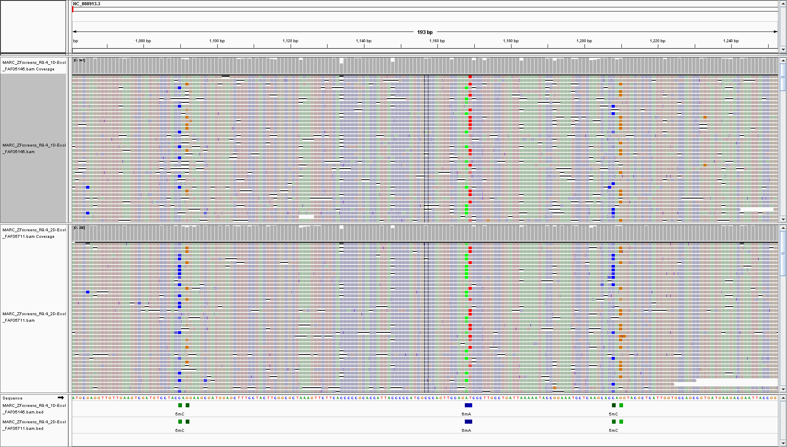

Alignments
==========
Alignments are performed using minimap2 and sorted BAM files are stored
in ``out_dir/minimap2`` directory.

We use recommended settings for mapping ONT reads: ``-ax map-ont``. 
For RNA samples, splice-aware mapping is automatically performed: ``-ax splice``.

Since the modification status is encoded within FastQ,
it'll be propagated through downstream analyses such as alignment and stored in BAM files.
And having modification status encoded in BAM allows visualisation of
modification probabilities directly in genome browsers.

	   
You can find more info about data formats `here <output.html#data-formats>`_. 

