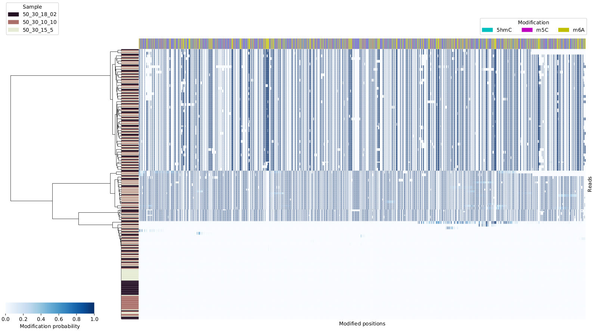

Read clustering
===============
You can also cluster reads by modification status. 
Note, this currently cluster entire reference sequences, 
so it's reasonable to run it only with individual transcritps.
Definitely, avoid clustering reads from entire chromosomes. 

.. code-block:: bash

   ~/src/modPhred/src/mod_cluster.py --minfreq 0.01 -i mod.gz -e pdf

This will produce plots similar to this one

You can specify regions of interest using ``-r``,
for example if you want to cluster reads that aligned to
chr1 at positions between 100 and 200 on the + strand, you'd run it as follows:

.. code-block:: bash

   ~/src/modPhred/src/mod_cluster.py --minfreq 0.01 -i mod.gz -e pdf -r chr1:100-200+

Clustering details
------------------

We perform clustering of reads as follows:

- user selects a region for read clustering
  ie. certain transcript or stranded genomic region
  
- identify a set of positions that are modified in that region
  ie. more than 20% of reads are modified (``--minfreq 0.2``)
  with least 25 reads aligned (``-d / --mindepth 25``) in at least one sample. 
  Importantly, we include all types of modifications in the analysis by default.
  Analysis can be limited to single modification using ``--mod``. 
  
- extract modification probabilities for a set of modified positions
  from all reads from all samples. 
  Note, the reads are filtered by mapping quality ``-m / --mapq 15``
  and their overlap with a selected region: 
  by default a read has to cover at least 80% of the selected region ``--minAlgFrac 0.8``. 

- perform hierarchical clustering & save a figure. 
  Only reads are clustered (modified positions are not clustered). 
  We're using implementation from
  `seaborn.clustermap <https://seaborn.pydata.org/generated/seaborn.clustermap.html>`_. 

At this point we don't report read clusters. 
