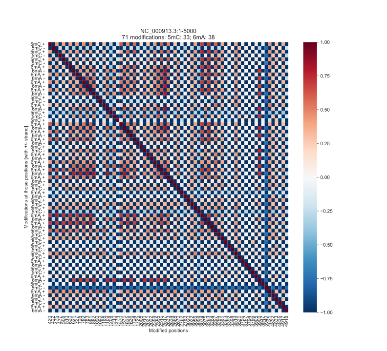
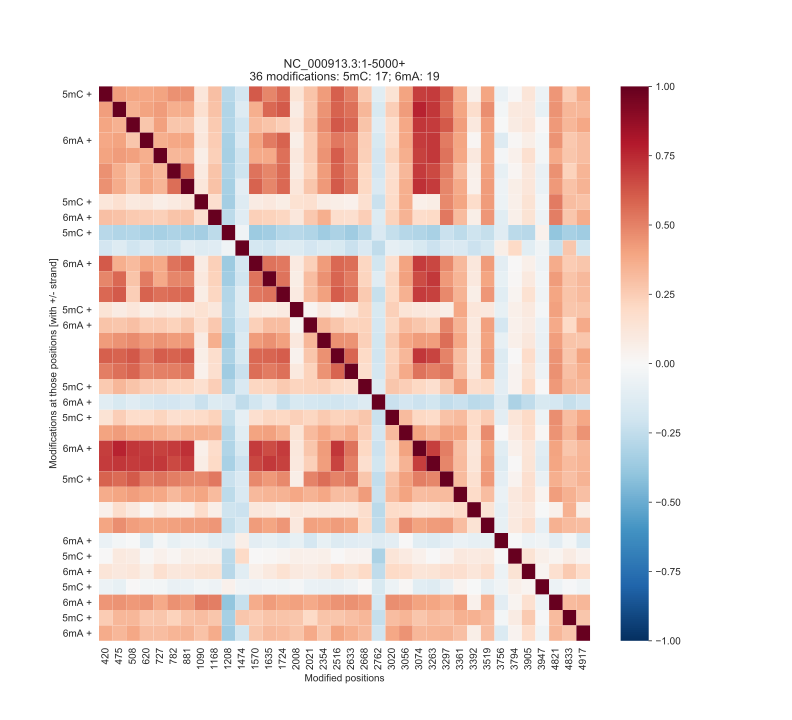
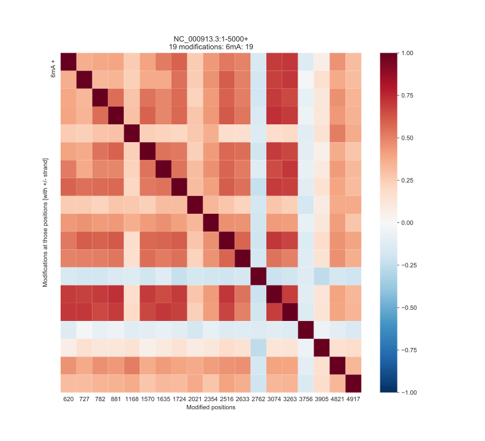

Correlation
===========
You can plot correlation between modified positions within certain regions.
This is as easy as: 

.. code-block:: bash

   ~/src/modPhred/src/mod_correlation.py -i modPhred/PRJEB22772/mod.gz -r NC_000913.3:1-5000

This will generate something like that:

In addition, using below you can narrow those plots to only:
* modifications from particular strand
* and one modification from particular strand

.. code-block:: bash

   ~/src/modPhred/src/mod_correlation.py -i modPhred/PRJEB22772/mod.gz -r NC_000913.3:1-5000+
   ~/src/modPhred/src/mod_correlation.py -i modPhred/PRJEB22772/mod.gz -r NC_000913.3:1-5000+ --mod 6mA

