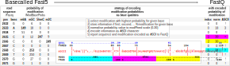

Encoding of modifications
=========================
Since basecall qualities are not very informative for Nanopore sequencing (typically valued between 7-12), we decided to store modification probabilities as FastQ base qualities. This is achieved as follows.

Guppy basecaller reports probability of base being modified in Fast5 files
under ``/Analyses/Basecall_1D_000/BaseCalled_template/ModBaseProbs``.
Those probabilities are stored as 8-bit integers scaled from 0 (no modification)
to 255 (modification) and are reported separately for all modifications
that given model has been trained for.
If we wanted to store just one modification per each base,
we could simply rescale those values to ASCII scale (0-93)
and store it as is (base qualities in FastQ files are stored as ASCII characters).
However, especially for RNA modifications, it would be beneficial to store information
about multiple possible modifications for given base
(ie. m5C and 5hmC are quite common for C) as there are over 170 known modifications in RNA.
If you want to store information for 3 modifications of every base,
this is up to 12 modifications in total,
one can rescale modification probabilities into 31 values (instead of 255 or 93)
and store the probability of the modification with the highest probability for given base.
For example, if you want to store information of about 3 modifications of C
(m5C, 5hmC and m3C), you can assign values of:

#. 0-30 to the first (m5C, PHRED 33-63),
#. 31-61 to the second (5hmC, PHRED 64-94)
#. and 62-92 to the third (m3C, PHRED 95-125) modification of C.

Now imagine in some read the base C (position 2635 below) has probabilities
of 12, 247, 9 for m5C, 5hmC and m3C, respectively.
Since only one probability can be stored for every base in FastQ,
the most informative would be to store probability of 5hmC since it has the highest
probability. We would rescale the probability of 247 to 31-unit scale as follows:

.. math::

   Q = 255 * max{p1, p2, p3} / 31 + 31 * Mi

where *Mi* (modification index) is

* 0 if first (m5C),
* 1 if second (5hmC)
* or 2 if third (m3C) modification of C
* has the highest probability of modification (p).

Such storage of information assures simplicity and versatility.
Since probability of modification is stored inside FastQ no external databases or
additional files are needed for calculation of modifications as the per base modification
probabilities for all reads will be stored also in BAM files that are derived from FastQ.
What's more, our encoding system is flexible - it can be easily adjusted to encode more modifications.
For example 9 modifications per each base, this is up to 36 modifications in total,
can be encoded given 10-value scale per modification is enough
(instead of 31 in default 3 values per modifications).

Theoretically our system allow encoding information about up to
368 modifications (92 per base) directly in FastQ format given we limit
the information about modifications status to binary form,
meaning either base is carrying one of the 368 modifications or not.

