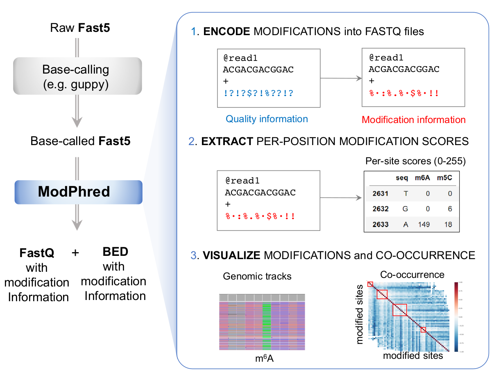

modPhred: Documentation
=======================

What is modPhred?
-----------------
modPhred is a pipeline for detection, annotation and visualisation of DNA/RNA modifications.
The pipeline consists of four steps / modules:

1. modEncode: encoding modification probabilities in FastQ (mod_encode.py)
2. modAlign: build alignments keepind modification information in BAMs (mod_align.py)
3. modReport: extraction of RNA modification information (bedGraph) and QC reports (mod_report.py)
4. modAnalysis:
   
   a. plotting QC stats, pairplots & venn diagrams (mod_plot.py),
   b. co-occurrence of modifications(mod_correlation.py)
   c. per-read clustering based on modification profiles (mod_cluster.py)

All these scripts can be run separately or as a pipeline by executing ``modPhred/run``.

What do I need to run ModPhred?
-------------------------------
To run modPhred, you will need:

0. :doc:`all dependencies installed <install>`
1. reference sequence (FastA)
2. raw ONT data (Fast5)
3. modification-aware guppy_basecaller model.

Currently, there is only one modification-aware model distributed together with guppy.
You can `find more experimental models <https://github.com/nanoporetech/rerio>`_ 
or you can train your own models using `taiyaki <https://github.com/nanoporetech/taiyaki>`_.

:doc:`More information about running the pipeline <usage>`.

Why use modPhred?
-----------------
Cause why not! And seriously, it is:

* free (MIT licensed) & fast (a few times faster than other tools)
* easy-to-use & versatile: will do all for you with just one command (or at least encoding of modifications in FastQ, alignments, detection of modified positions, QC & plotting...)
* powerfull & space-optimised: it stores the modification status inside FastQ/BAM
  
  * no external files/DBs needed
  * you can visualise modification status of all bases of all reads in your favourite genome browser ie IGV
  * you can remove all basecalled Fast5 files to save disk space
    or skip separate basecalling step entirely thanks to on-the-fly basecalling!

* visually attractive: it produces nice plots (or at least not so bad so far... still working on it;) )

Getting help
------------
If you have any questions, issues or doubts, first please get familiar with our documentation.
This should address most common questions/problems. 
Then, have a look at `issues <https://github.com/novoalab/modPhred/issues?q=>`_
users reported so far. If you don't find the solution, please open a new one.

What does modPhred stand for?
-----------------------------
The tool stores base modification status (probability of base having various types of modifications)
encoded inside FastQ/BAM file instead of base quality (also called Phred scores),
thus **mod** (for modification) & **Phred** (for base quality).. Or something like that :P  

Initially, this tool was called **Pszczyna**,
`pronounced ˈpʂt͡ʂɨna <https://forvo.com/word/pszczyna/>`_,
but since almost no one could pronounce or memorise it, 
we came up with much easier, yet so much less sexy name...
There are `numerous more interesting words that Pszczyna in Polish <https://www.youtube.com/watch?v=AfKZclMWS1U>`_.
For more information, `check Wikipedia <https://en.wikipedia.org/wiki/Pszczyna>`_.

.. _citation:

Citation
--------

Manuscript is in preparation. Till preprint is ready, please cite this repository.

Please, consider citing :doc:`dependencies <install>` as well.

.. toctree::
   :maxdepth: 2
   :hidden:
   :caption: First steps
	     
   install
   test
   usage
   output
   plot
   correlate
   cluster

.. toctree::
   :maxdepth: 2
   :hidden:
   :caption: Methods
	     
   encode
   align
   report
   
