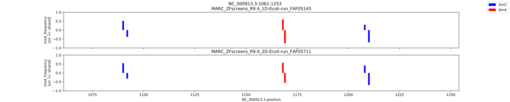

	   
Visualisation
=============
Instead of looking at text files described below,
you can visualies some aspects of the DNA/RNA modifications.

QC plots
--------
QC plots are generated automatically at the end of modPhred pipeline run.
For all detected positions with likely modifications from all samples,
those plots inform about various distribution for all modifications:

* depth of coverage
* basecall accuracy (taking into account substitutions, but ignoring indels)
* modification frequency
* and median modification probability of bases with modifications

Compare samples
^^^^^^^^^^^^^^^
In addition, modPhred can generate pairwise plots of above measurements
for all modifications, for all modified positions between all samples.

.. code-block:: bash

   ~/src/modPhred/src/mod_plot.py --scatter -i modPhred/PRJEB22772/mod.gz

Above will produce plots similar to these:
	   

Modification frequency in certain regions
-----------------------------------------
You can plot type and frequency of modifications for selected regions as follows:

.. code-block:: bash

   ~/src/modPhred/src/mod_plot.py -i modPhred/PRJEB22772/mod.gz -b "NC_000913.3:1,061-1,253"

This will create directory modPhred/PRJEB22772/plots with separate figures for each region
that was provided either via command line of BED-file.
Every figure will plot frequency of modification for all modifications (in different colours)
and for every run/sample in different panel separately for + (positive values of frequency)
and - strand (negative values of frequency).

From above plot it's very easy to conclude that enzymes depositing 5mC and 5mA in DNA
are likely acting on sequence motifs that are palindromic because modification
on + strand is always followed by modification on - strand.

.. _visualisation-in-genome-browsers-igv:
	 
Visualisation in genome browsers (IGV)
--------------------------------------
Modification probabilities for individual reads and bases can be viewed directly in
genome browsers (such as IGV) given you have model with 1 modification per base.
If you have more than 1 modification per base the probabilities of 2nd and further
modificaiton for given base will be rendered improperly.

To do so:

#. open IGV,
#. load your reference genome (Genomes > Load genome from File... and select file ``ref/ECOLI.fa``),
#. load BAM files generated by modPhred (File > Load from File... and select ``.bam`` files inside ``/minimap2`` folder),
#. load BED files generated by modPhred (File > Load from File... and select ``.bed`` files inside ``/minimap2`` folder),
#. select some region ie ``NC_000913.3:1,061-1,253``
#. collapse alignments (mouse right-click and tick Collapsed)
#. make all bases visible (mouse right-click and tick Show all bases)
#. and shade by quality (mouse right-click and tick Shade base by quality)
   
You should see something like this:

.. image:: NC_000913.3:1061-1253.png
   :align: center

Now you can easily see positions that contain modified bases:

* bedMethyl tracks (BED files) show different modifications in different colours,
  plus the frequency of modification is depicted as the colour intensity
  (darker means more reads are modified at given position)
  
* and when you zoom-in you can clearly see the probability of this base being modified
  for every read and every base in the read - the intensity of base color is proportional
  to the probability of that base being modified.

Cool, right?
