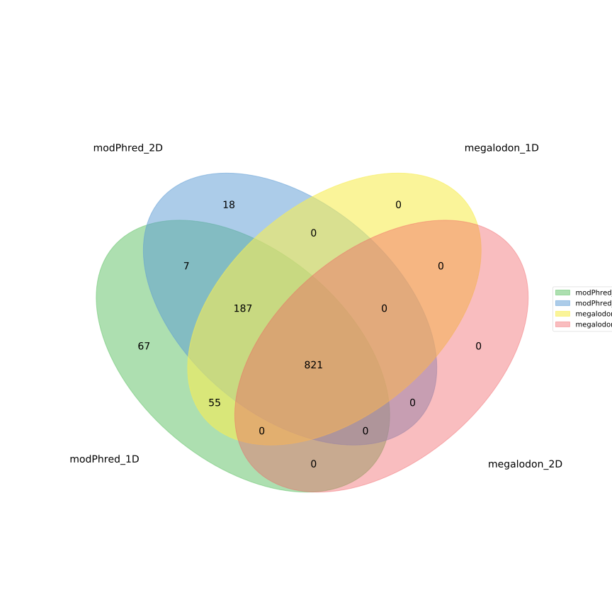
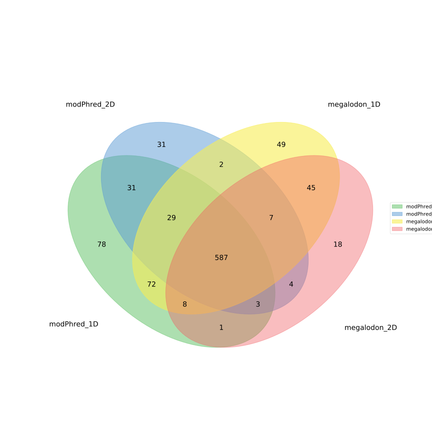

Test datasets
=============

Below you'll find detailed information on running modPhred pipeline on test dataset.
You have two options:

* download raw Fast5 files and run modPhred with live basecalling
  (you'll need NVIDIA GPU with CUDA installed either locally or in a remote computer)
  
* download pre-basecalled Fast5 and run modPhred with pre-basecalled Fast5 files
  (no GPU needed)

ModPhred pipeline with live basecalling
---------------------------------------

Download test data
^^^^^^^^^^^^^^^^^^
Get raw Fast5 data from `PRJEB22772 <https://www.ebi.ac.uk/ena/data/view/PRJEB22772>`_
(subset of reads from ``NC_000913.3:1-100000``):

.. code-block:: bash

   mkdir -p test
   cd test
   wget https://public-docs.crg.es/enovoa/public/lpryszcz/src/modPhred/test/ -q --show-progress -r -c -nc -np -nH --cut-dirs=6 --reject="index.html*"

Run modPhred (local basecalling)
^^^^^^^^^^^^^^^^^^^^^^^^^^^^^^^^
Running entire modPhred pipeline with live basecalling (~6 minutes using RTX2080Ti):

.. code-block:: bash

   acc=PRJEB22772
   ~/src/modPhred/run -f ref/ECOLI.fa -o modPhred/$acc -i $acc/* -t4 --host ~/src/ont-guppy_3.6.1/bin/guppy_basecall_server
   
Instead you can run all steps one-by-one as follow:

.. code-block:: bash

   ~/src/modPhred/src/guppy_encode_live.py -i $acc/* -o modPhred/$acc --host ~/src/ont-guppy_3.6.1/bin/guppy_basecall_server
   ~/src/modPhred/src/guppy_align.py -f ref/ECOLI.fa -o modPhred/$acc -i modPhred/$acc/reads/*
   ~/src/modPhred/src/mod_report.py -f ref/ECOLI.fa -o modPhred/$acc -i $acc/*
   ~/src/modPhred/src/mod_plot.py -i modPhred/$acc/mod.gz

Some examples of visualisation of the obtained results are described :doc:`here <plot>`.

Run modPhred (remote basecalling)
^^^^^^^^^^^^^^^^^^^^^^^^^^^^^^^^^

If you want to run live basecalling using remote instance of guppy (ie from GridION), 
you'll need to provide the IP and the port at which guppy_basecall_server is listening

.. code-block:: bash

   acc=PRJEB22772
   ~/src/modPhred/run -f ref/ECOLI.fa -o modPhred/$acc -i $acc/* -t4 --host 10.46.1.65 -p 5556

ModPhred pipeline with basecalled Fast5 files
---------------------------------------------

Download pre-basecalled test data
^^^^^^^^^^^^^^^^^^^^^^^^^^^^^^^^^
If you can't run basecalling, you can download pre-basecalled Fast5 files using:

.. code-block:: bash

   wget https://public-docs.crg.es/enovoa/public/lpryszcz/src/modPhred/basecalled/ -q --show-progress -r -c -nc -np -nH --cut-dirs=6 --reject="index.html*"

Run modPhred (pre-basecalled)
^^^^^^^^^^^^^^^^^^^^^^^^^^^^^
Running entire modPhred pipeline from basecalled Fast5 files (~4 minutes):

.. code-block:: bash

   acc=PRJEB22772; ver=3.4.1
   ~/src/modPhred/run -f ref/ECOLI.fa -o modPhred/$acc -ri guppy$ver/$acc/* -t4

Instead you can run all steps one-by-one as follow:

.. code-block:: bash

   ~/src/modPhred/src/guppy_encode.py -o modPhred/$acc -ri guppy$ver/$acc/*
   ~/src/modPhred/src/guppy_align.py -f ref/ECOLI.fa -o modPhred/$acc -ri modPhred/$acc/reads/*
   ~/src/modPhred/src/mod_report.py -f ref/ECOLI.fa -o modPhred/$acc -ri guppy$ver/$acc/*
   ~/src/modPhred/src/mod_plot.py -i modPhred/$acc/mod.gz

Some examples of visualisation of the obtained results are described :doc:`here <plot>`.

Note, here we separately basecalled Fast5 files and then ran modPhred.
However in real-live, we **strongly recommend performing on-the-fly basecalling**.
You'll find more usage information :doc:`here <usage>`.
   
Compare modPhred and megalodon results
--------------------------------------
You can download precomputed modPhred and megalodon results using

.. code-block:: bash

   wget https://public-docs.crg.es/enovoa/public/lpryszcz/src/modPhred/final/ -q --show-progress -r -c -nc -np -nH --cut-dirs=6 --reject="index.html*"

Now, you can compare predictions made by those tools.

.. code-block:: bash

   # separate modPhred predictions for 6mA and 5mC and filter to those with 5% frequency
   for f in modPhred/PRJEB22772/minimap2/*.bam.bed; do echo $f; for m in 6mA 5mC; do grep -w $m $f | awk '$11>=5' > $f.$m.flt.bed; done; done
   
   # filter results to only sites with at least 5% of reads carrying modification
   for f in megalodon/PRJEB22772/*/modified_bases.???.bed; do echo $f; awk '$11>=5' $f > $f.flt.bed; done
   
   # get number of predictions for each run
   wc -l modPhred/PRJEB22772/minimap2/*.flt.bed megalodon/PRJEB22772/*/modified_bases*.flt.bed

   # draw Venn diagram for both mods
   for m in 6mA 5mC; do
    ~/src/modPhred/src/mod_plot.py --venn {modPhred,megalodon}/PRJEB22772/*/*$m*.flt.bed -n modPhred_1D modPhred_2D megalodon_1D megalodon_2D -o venn.$m.05.svg;
   done

Above will produce Venn diagrams similar to these:

	   
For more detailed comparison have a look in :ref:`modPhred paper <citation>`. 

For more examples of downstream analyses, check :doc:`here <plot>`. 

Test data generation
--------------------
The test data was generated from `PRJEB22772 <https://www.ebi.ac.uk/ena/data/view/PRJEB22772>`_
by selecting only reads aligned to ``NC_000913.3:1-100000`` as follows:

.. code-block:: bash

   acc=PRJEB22772
   for d in _archives/raw/$acc/*; do
    s=`echo $d|rev|cut -f1 -d"/"|rev`
    echo `date` $d $s
    if [ ! -d ~/src/modPhred/test/$acc/$s ]; then
     mkdir -p ~/src/modPhred/test/$acc/$s
     # get read IDs
     samtools view modPhred/$acc/minimap2/$s.bam "NC_000913.3:1-100000" | cut -f1 | sort | uniq > modPhred/$acc/minimap2/$s.bam.ids
     # subset reads
     python ~/src/ont_fast5_api/ont_fast5_api/conversion_tools/multi_fast5_subset.py -t 4 --recursive -l modPhred/$acc/minimap2/$s.bam.ids -i $d -s ~/src/modPhred/test/$acc/$s
    fi
   done

